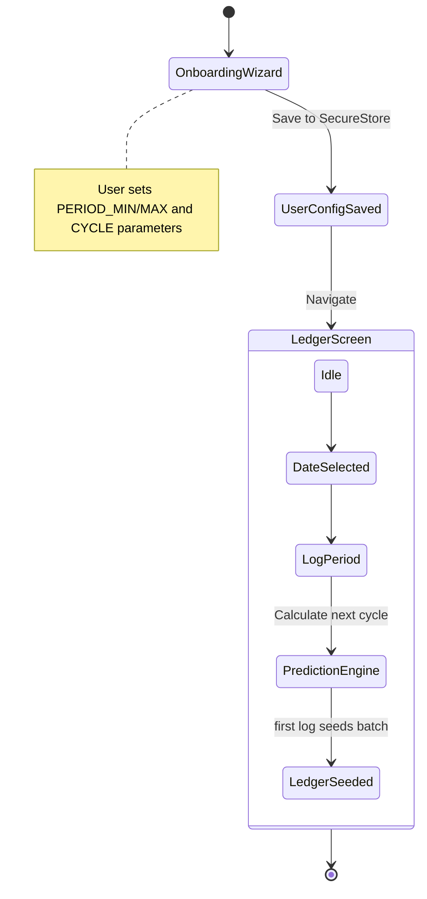
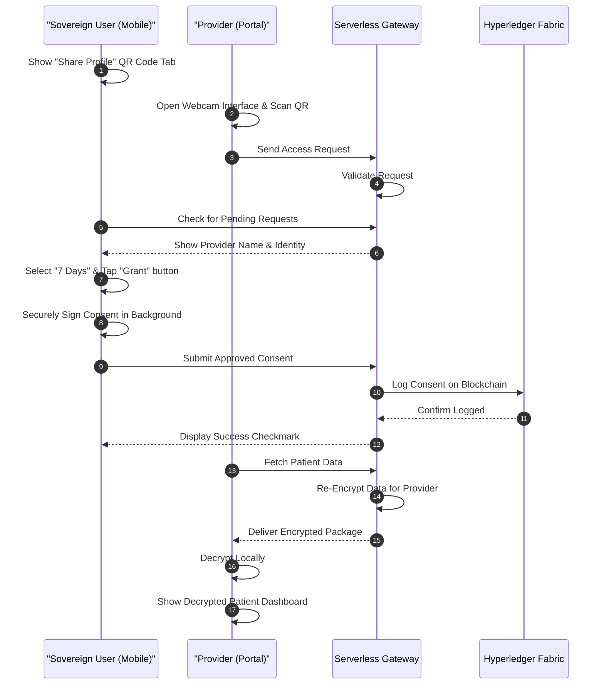
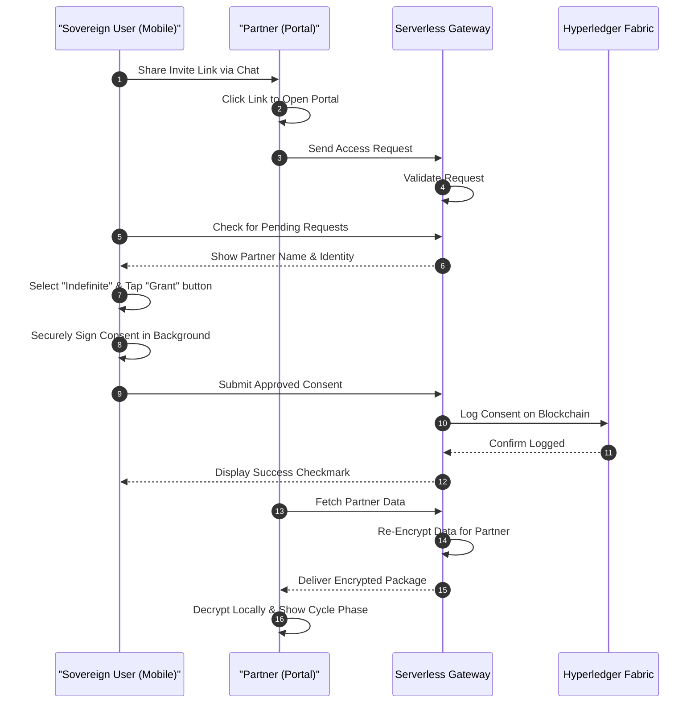
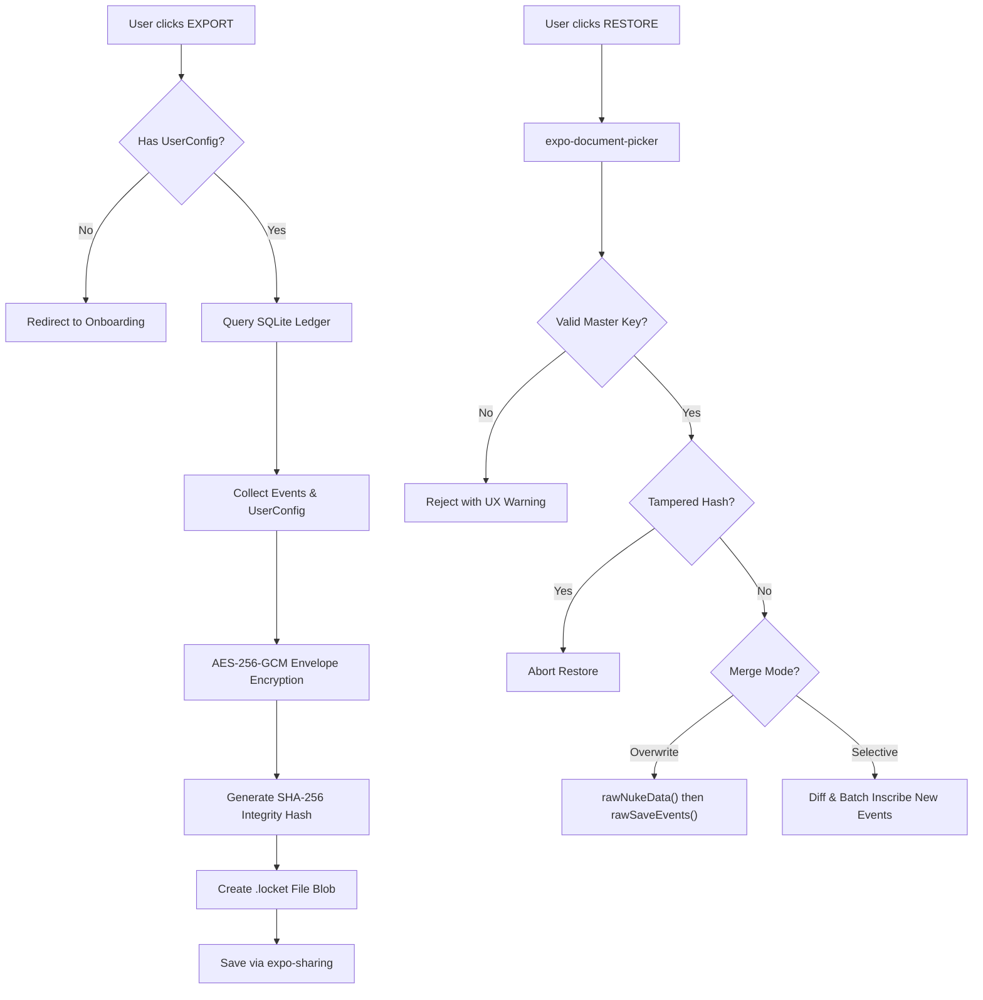

# Locket v1.x.x Product Roadmap: Epics, Stories & Journeys
**From Pre-Production (0.9.x) to Post-Production Alpha (1.x.x)**

This document serves as the single source of truth for bridging the Locket Mobile App, Provider Portal, Partner Portal, and Serverless Gateway from their functional MVPs to a polished, user-tested Alpha.

---

## 1. Product Vision & Goals for 1.x.x
The core 0.9.x infrastructure successfully implemented the `@locket/crypto-engine` (Umbral PRE), Hyperledger Fabric consent anchoring, and isolated data decoding. For the 1.x.x Alpha, our goal is to **humanize the Sovereign Journal experience** by reducing UX friction, increasing robustness in edge cases (e.g., data merging), and enriching the web portals for actual clinical or partner use.

### Goals
- Enhance the UI/UX with the "Sovereign Journal & Digital Ledger" aesthetics.
- Solidify data portability and backup recovery.
- Add contextual interpretation (relational phases) to partner data.
- Ensure end-to-end resilience of the proxy re-encryption pipeline in unpredictable network conditions.

---

## 2. User Personas

1. **The Sovereign User (Alice):** Highly privacy-conscious individual tracking personal health/cycle data. Demands offline capability, absolute control over data access, and an aesthetically premium journal interface.
2. **The Clinical Provider (Dr. Smith):** Needs frictionless adoption of Alice's data. Relies exclusively on standard formats (HL7 FHIR R4) and simple QR-based handshakes.
3. **The Partner (Bob):** Wants limited, read-only insights into Alice's current phase without needing complex healthcare formats—prefers simplified, relatable endpoints.

---

## 3. Epics & User Stories

### Epic 1: Polished "Sovereign Journal" Experience
*Transform the functional mobile app into a premium, accessible daily journaling tool.*

- **Story 1.1:** As a User, I want a Horizontal "Paper" Calendar Navigation component, so I can seamlessly scroll through my history.
- **Story 1.2:** As a User, I want a Data Entry Pop-Up that feels natural and fluid, so logging symptoms takes minimal effort.
- **Story 1.3:** As a User, I want Intelligent Auto-fill for my most common period lengths, so I don't have to manually adjust dates every cycle.
- **Story 1.4:** As a User, I want a dedicated Settings screen that consolidates export, restore, sync, and factory reset actions, so my main Ledger screen remains uncluttered.
- **Story 1.5:** As a User, I want a Light/Dark theme toggle contextually linked to the Sovereign aesthetic, so the app remains comfortable to use at night.
- **Story 1.6:** As a User, I want a prominent, multi-step warning before initiating a "Factory Reset," so I do not accidentally wipe my local SQLite database and keys.
- **Story 1.7** As a User, I want to filter my cycle data by date range or specific symptoms, so I can efficiently review relevant cycle patterns.
### Epic 2: Advanced Data Recovery & Portability
*Enhance the Phase 9 (AES-GCM-256) backup to be more forgiving for real-world usage.*

- **Story 2.1:** As a User, I want the option to selectively merge an imported backup with my current localized ledger, rather than performing a destructive overwrite (`rawNukeData`).
- **Story 2.2:** As a User imported from legacy apps (Clue/Flo), I want my imported historical data to be automatically encrypted and batch-inscribed into the ledger seamlessly.
- **Story 2.3:** As a User, I want the app to periodically prompt me to export a new `.locket` backup file if I haven't done so recently.

### Epic 3: Partner & Provider Portal Evolution
*Upgrade the Vite React portals (Phase 7 & 8) to seamlessly initiate access requests instead of relying on mobile scanning.*

- **Story 3.1:** As a Provider, I want to use my portal's webcam to scan a patient's QR code, so I can trigger a formal request for their FHIR-formatted health data.
- **Story 3.2:** As a Partner, I want to request access via a shared link during a remote session, so I can view my partner's cycle phases without being physically present.
- **Story 3.3:** As a Provider, I want to download the FHIR bundle after it's parsed, so I can seamlessly ingest it into my external EHR system.
- **Story 3.4:** As a Provider, I want to filter the decrypted patient records by date range or specific symptoms, so I can efficiently review relevant clinical patterns.
- **Story 3.5:** As a Partner, I want the portal to calculate and display relational cycle phases (e.g., Follicular, Luteal), so I have easily understandable context for the data shared with me.
- **Story 3.6:** As a Partner, I want a visual indicator when new data has been synced to the portal since my last visit, so I know when my partner is actively logging entries.
- **Story 3.7:** As a Provider or Partner, I want clear UX error states (empty states, token expiration warnings, revoked access) when querying `/api/data/request`, so I know exactly why decryption might fail.

### Epic 4: Role-Based Consent & Sync
*Overhaul the consent model so requestors ask and the sovereign user approves via in-app review cards.*

- **Story 4.1:** As a User, I want to display a QR code or send a link containing my public ID, so that a doctor or partner can initiate an access request without my device needing camera permissions.
- **Story 4.2:** As a User, I want to see a human-readable "Review Card" (e.g., "City Clinic requesting access"), so I know exactly who I am sharing data with before approving.
- **Story 4.3:** As a User, I want to select specific access durations (24h, 7d, 30d, or Indefinite), so I can maintain granular control over my data's shelf-life.
- **Story 4.4:** As a Developer, I want to rate-limit consent requests per recipient DID, so the system is protected against spam if a user's QR code or public identity is leaked.
- **Story 4.5:** As a User, I want the background sync service to continuously encrypt and upload my ledger changes independently of any active consent handshakes, ensuring data is never stale.

---

## 4. User Journeys

### Journey 1: Onboarding to First Log (State Diagram)
*Maps the user's flow from establishing the ledger (Phase 3) through creating their first encrypted log.*

### Journey 2: The Clinical Handshake (In-Person)
*Visualizes the integration for role-based consent where the provider is physically present to scan the QR code.*

### Journey 3: Remote Partner Support (Telehealth/Remote)
*Visualizes the integration for role-based consent where a partner triggers a request via a shared link.*

### Journey 4: Backup Exfiltration and Restore (Flowchart)
*Displays the decision tree around Phase 9.1 Sovereign Persistence.*

---

## 5. Epic and Story Mapping by Persona

Using the `@product-manager-toolkit` frameworks, the following tables organize each story by Persona and assign a **MoSCoW Priority** (Must/Should/Could/Won't Have) alongside the **Success Metric** we will use to measure its impact.

### Persona: The Sovereign User (Alice)
*Experiences the core value of journaling, persistence, and sync. Drives the aesthetic and privacy requirements.*

| Epic | User Story | MoSCoW Priority | Success Metric |
|------|------------|-----------------|----------------|
| **Epic 1:** Polished Experience | 1.1 Horizontal "Paper" Calendar Navigation | **Must Have** | Calendar feature adoption rate |
| **Epic 1:** Polished Experience | 1.2 Data Entry Pop-Up | **Must Have** | Average logs per cycle per user |
| **Epic 1:** Polished Experience | 1.3 Intelligent Auto-fill | **Should Have** | % of cycles using auto-fill settings |
| **Epic 1:** Polished Experience | 1.4 Dedicated Settings screen | **Must Have** | Decrease in LedgerScreen clutter |
| **Epic 1:** Polished Experience | 1.5 Light/Dark theme toggle | **Should Have** | % of DAU interacting with the toggle |
| **Epic 1:** Polished Experience | 1.6 "Factory Reset" warning | **Must Have** | 0 accidental DB wipes in telemetry |
| **Epic 1:** Polished Experience | 1.7 Filter cycle data by date/symptom | **Should Have** | Feature adoption rate by users |
| **Epic 2:** Advanced Recovery | 2.1 Selectively merge backups | **Must Have** | Successful uncorrupted merge rate |
| **Epic 2:** Advanced Recovery | 2.2 Import from Clue/Flo | **Should Have** | Volume of imported historical CSVs |
| **Epic 2:** Advanced Recovery | 2.3 Periodic backup prompts | **Could Have** | % of MAU possessing recent backups |
| **Epic 4:** Role-Based Consent & Sync | 4.1 Display QR / Share Link | **Must Have** | High conversion starting request flows |
| **Epic 4:** Role-Based Consent & Sync | 4.2 Human-readable "Review Card" | **Must Have** | Zero blind approvals |
| **Epic 4:** Role-Based Consent & Sync | 4.3 Selectable access durations | **Must Have** | Balanced duration distribution (not just indefinite) |
| **Epic 4:** Role-Based Consent & Sync | 4.4 Rate-limit consent requests | **Must Have** | 0 instances of brute-force spam |
| **Epic 4:** Role-Based Consent & Sync | 4.5 Decoupled Background Sync | **Must Have** | 100% data availability upon consent grant |

---

### Persona: The Clinical Provider (Dr. Smith)
*Consumes Alice's data through the portal. Needs FHIR R4 formatting and robust error states.*

| Epic | User Story | MoSCoW Priority | Success Metric |
|------|------------|-----------------|----------------|
| **Epic 3:** Portal Evolution | 3.1 Portal Webcam Scanning | **Must Have** | Speed to successful request |
| **Epic 3:** Portal Evolution | 3.3 "Download FHIR Bundle" | **Must Have** | Total downloaded generic FHIR bundles |
| **Epic 3:** Portal Evolution | 3.4 Filter records by date/symptom | **Should Have** | Feature adoption rate by providers |
| **Epic 3:** Portal Evolution | 3.7 Clear UX error states | **Must Have** | Drop in provider support queries |

---

### Persona: The Partner (Bob)
*Views interpreted, relational cycle phases through a simplified web experience without dense clinical data.*

| Epic | User Story | MoSCoW Priority | Success Metric |
|------|------------|-----------------|----------------|
| **Epic 3:** Portal Evolution | 3.2 Request access via shared link | **Must Have** | Remote link conversion rate |
| **Epic 3:** Portal Evolution | 3.5 Display relational cycle phases | **Must Have** | Daily active usage of Partner Portal |
| **Epic 3:** Portal Evolution | 3.6 Visual indicator for new data | **Should Have** | Return visit frequency |
| **Epic 3:** Portal Evolution | 3.7 Clear UX error states | **Must Have** | Drop in partner confusion/bounces |
