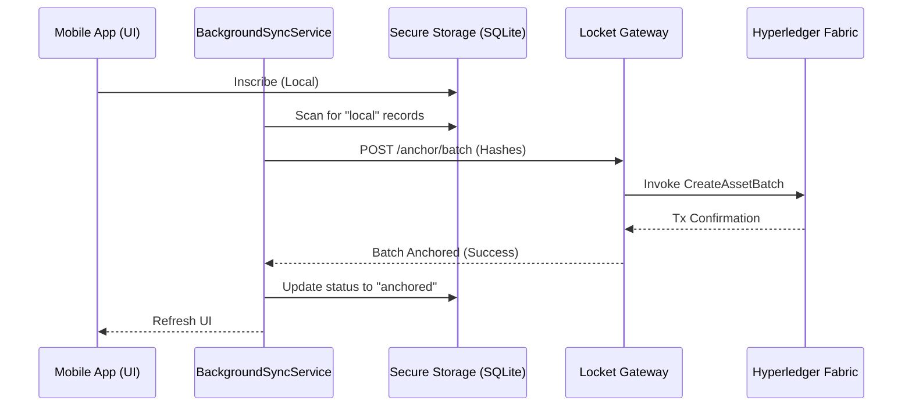

no# Phase 3 Walkthrough: Background Anchor

We have successfully implemented the **Background Anchor** phase, transitioning from immediate, single-hash anchoring to a more efficient and robust batch anchoring system.

## Key Accomplishments

### 1. Batch Anchoring Logic
We optimized the entire pipeline to support multiple integrity hashes in a single blockchain transaction.

*   **IntegrityContract (Chaincode)**: Added `CreateAssetBatch` to handle multiple asset creations atomically.
*   **Gateway API**: Added `POST /api/anchor/batch` to bridge the mobile app's batch requests to the blockchain.
*   **BlockchainService (Mobile)**: Implemented `anchorBatch` to communicate with the new gateway endpoint.

### 2. Optimistic Sync Engine
The `BackgroundSyncService` manages the lifecycle of local data:

*   **Status Tracking**: Records start as `local` and transition to `anchored` once confirmed on-chain.
*   **7-Event Threshold**: To align with our 7-day auto-fill feature, the engine automatically triggers a sync when 7 or more local events are detected.
*   **Demo-Optimized**: Includes a "Pulsing" log mechanism for clear visibility during MVP demonstrations.

### 3. Progressive UI Updates
The `LedgerScreen` now reflects the state of the decentralized ledger with high-fidelity feedback:

*   **SYNC Button**: A manual override allows users to force a blockchain anchor at any time.
*   **Honest Status Signaling**:
    *   🔵 **Pulsing Blue**: Active work. The seal pulses and shows "Securing..." while the gateway is processing the batch.
    *   🟡 **Gold**: Data is secured locally with deterministic hashing, waiting for the batch threshold.
    *   🟢 **Green**: All data in the current view is successfully anchored to the blockchain.
    *   ⚪ **White**: System is initializing or checking status.

### 4. Resilience & Migration
*   **ID Migration**: On startup, the ledger now automatically repairs any legacy records missing unique IDs, ensuring they can be tracked during the sync/update cycle.
*   **Null-Safety**: The Sync Engine now gracefully handles initialization race conditions, preventing crashes during rapid user interactions.

### Architectural Data Flow


### Code Implementation Highlights

#### Batch Chaincode
```javascript
async CreateAssetBatch(ctx, assetsJson) {
    const assets = JSON.parse(assetsJson);
    for (const asset of assets) {
        await ctx.stub.putState(asset.ID, Buffer.from(JSON.stringify(asset)));
    }
}
```

#### Sync Engine Logic
```typescript
async executeAnchorBatch(pending: StorageRecord[], ledger: any, onSyncComplete?: () => void) {
    // ... Prepare assets ...
    const result = await BlockchainService.anchorBatch(assets);
    if (result.success) {
        // ... Mark logic ...
        await ledger.saveEvents(updatedRecords);
        if (onSyncComplete) onSyncComplete();
    }
}
```

## Verification Proof

### E2E Script Verification
We validated both single-item and batch anchoring directly against the Gateway API:

```text
--- STARTING E2E VERIFICATION ---
[Client] Generated Hash: 1af173...
[Client] Sending Anchor Request...
[Client] Anchor Success! { success: true, assetId: 'asset-1767627037865-280' }
SUCCESS: Hash Matches! Zero-Knowledge Integrity Proven.

--- STARTING BATCH VERIFICATION ---
[Client] Sending 3 items to batch anchor...
[Client] Batch Anchor Success! { success: true, results: [...] }
[Client] Verifying first asset in batch: asset-1767627040304-947685
SUCCESS: Batch Integrity Verified.
```

### Mobile App Lifecycle
Verified the "Reset -> Inscribe -> Batch Sync" flow:
1. **RESET**: Wipes key/data (verified `[SecureKey] Key Nuked`).
2. **INSCRIBE**: Adding a 7-day period entry creates a local batch.
3. **SYNC**: The Sync Engine detects local records, anchors them via the Gateway, and updates local status.
4. **GREEN SEAL**: Confirmed by logs: `[LedgerScreen] Seal Result: anchored (GREEN)`.

#### Live Execution Logs
```text
@locket/mobile:dev:  LOG  [SyncEngine] Pulse started. Scanning for local records...
@locket/mobile:dev:  LOG  [SyncEngine] Found 7 anchorable records.
@locket/mobile:dev:  LOG  [SyncEngine] Anchoring Batch: Tracking IDs [0x481b5b, 0x79bcf3, ...]
@locket/mobile:dev:  LOG  [SyncEngine] Success: Batch anchored (Tx: committed)
@locket/mobile:dev:  LOG  [FileSystemLedger] saveEvents: before=7, after=7, added=0
@locket/mobile:dev:  WARN [LedgerScreen] Seal Result: anchored (GREEN)
```

## Next Steps
- [DONE] Batch Inscribe (7-day period auto-fill).
- [DONE] Optimistic Sync Engine with 7-event threshold.
- [DONE] Decentralized Integrity Seal (Gold -> Blue -> Green).
- Implement `VerificationService` for independent block-level integrity checks against the blockchain.
- Schedule periodic background syncs while the app is in the background.
- Integrate MCP remote server into IDE to automate checking for vulnerable dependencies, malwares, and license compliance
